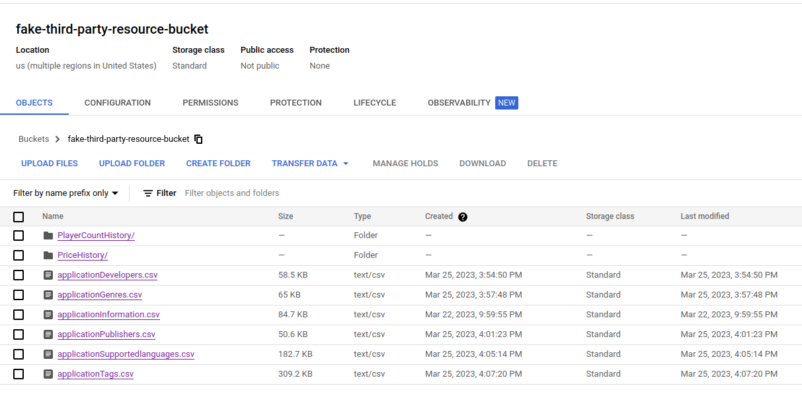

# de-course-final-project

Final project for `Data Engineering Zoomcamp` course from [DataTalksClub](https://github.com/DataTalksClub)

## Technology stack

- Google Cloud Platform
  - Google Cloud Storage
  - BigQuery
- Terraform
- Airflow
- DBT
- Docker

## Pipeline diagram

TODO

## Project structure

```
airflow /      contains Airflow project for data orchestration
credentials /  contains json keys for GCP service account (empty for obvious reasons)
dbt /          contains DBT project for data transformation
docs /         contains files and images for project documentation
terraform /    contains Terraform project for initialization of project infrastructure in GCP
```

## Problem description

Source data for `Steam Games Dataset` located in https://data.mendeley.com/datasets/ycy3sy3vj2/1 . 
Part of files are in `.csv`, part files in `.zip` archive. And I had two ways to create data pipeline:

- Download all files and load them to `GCP` bucket from local storage
- Imitate `fake` bucket and load all files in it. After that this bucket will be as `third-party` source for data.

I choose the second way and created manually bucket `fake-third-party-resource-bucket`:



In fact, I just moved `.csv` files, unzipped archives and uploaded them to bucket as folders.

## Dataset source description

As described above `fake-third-party-resource-bucket` bucket in GCP is our data source.

`fake-third-party-resource-bucket` structure (read more in [about dataset](../docs/about_dataset.md)):

```bash
    PlayerCountHistory/
      10.csv
      ...
      13400.csv
    PriceHistory/
      10.csv
      ...
      13400.csv
    applicationDevelopers.csv
    applicationGenres.csv
    applicationInformation.csv
    applicationPublishers.csv
    applicationSupportedLanguages.csv
    applicationTags.csv
```

## Table of contents

- [About Steam Games Dataset](docs/about_dataset.md)
- [Terraform project documentation](terraform/README.md)
- [AirFlow project documentation](airflow/README.md)
- [DBT project documentation]()
