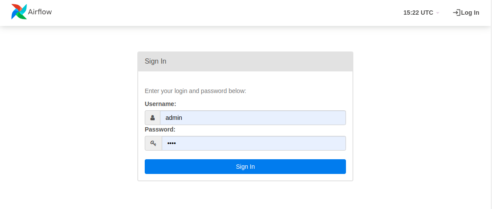
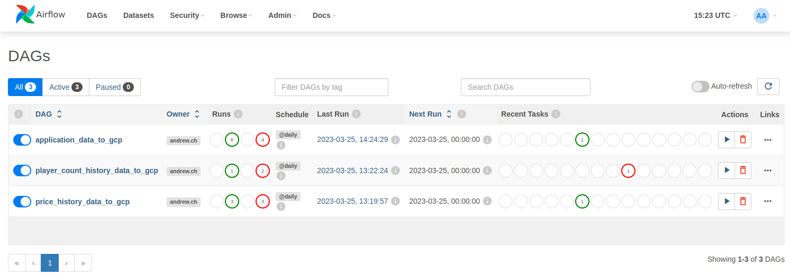
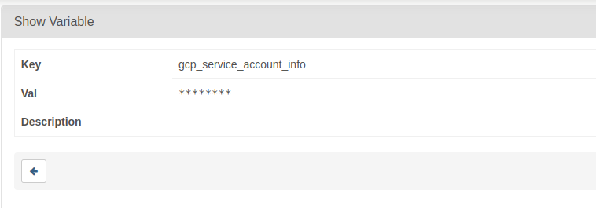
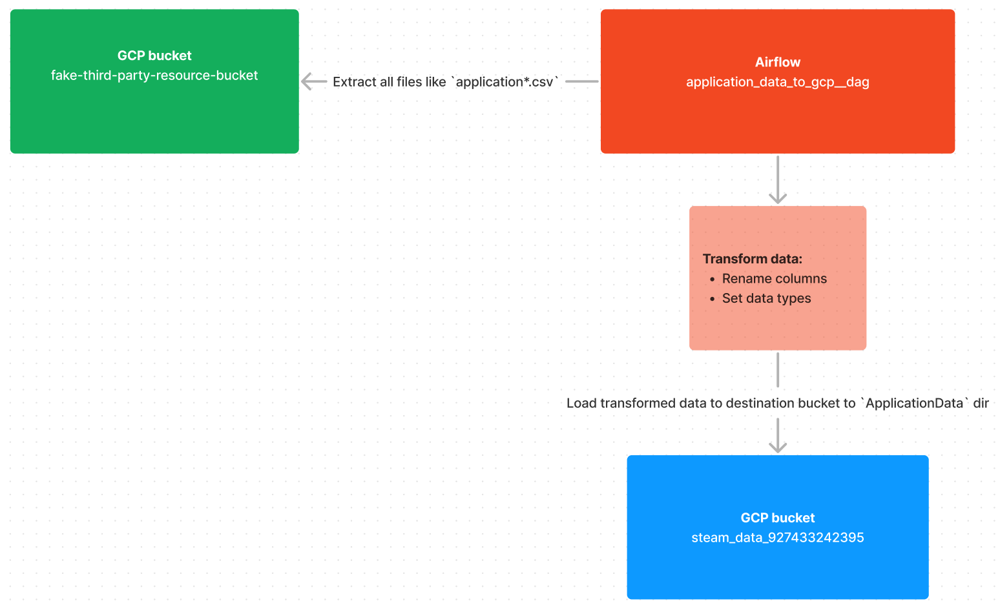
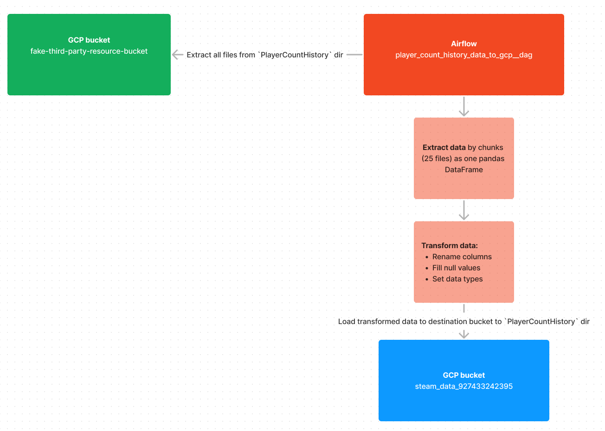
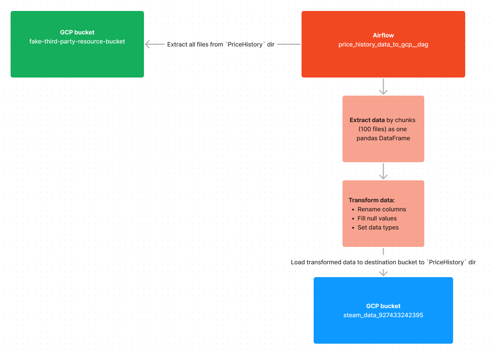

# Airflow project

## Project structure

```bash
    dags/         contains Airflow dags for data orchestration to GCP
      utils/      contains utils for Airflow dags
      configs/    contains configs for Airflow dags
    logs/         contains logs from Airflow
    plugins/      contains plugins for Airflow
```

## Local setup & run

1. Build docker containers with command:
    ```bash
    docker compose build
    ```

2. Run docker containers with command:
    ```bash
    docker-compose up
    ```

3. Go to http://localhost:8080/

4. Type `admin` as login and `test` as password in UI:



5. In `home` page you can see 3 dags:



6. Create variable `gcp_service_account_info` and paste in `val` input body of your `service account` json file:



7. To stop all docker containers press `CTRL+C`

## About dag's

### `application_data_to_gcp__dag.py`

> Runs ETL processes for `application*.csv` files and saves data (in `.parquet`) to `steam_data_927433242395` bucket.
   
Data pipeline diagram:



### `player_count_history_data_to_gcp__dag.py`

> Runs ETL processes for `PlayerCountHistory/*.csv` files and saves data (in `.parquet`) to `steam_data_927433242395` bucket.

Data pipeline diagram:



### `price_history_data_to_gcp__dag`

> Runs ETL processes for `PriceHistory/*.csv` files and saves data (in `.parquet`) to `steam_data_927433242395` bucket.

Data pipeline diagram:

