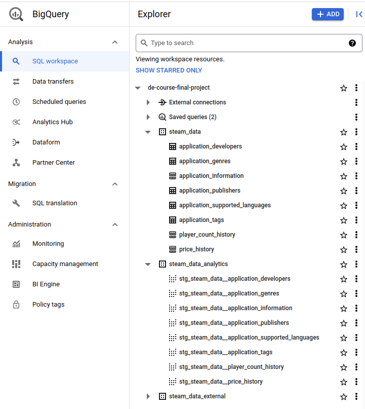

# DBT project

## Models linage graph


## Local setup & run

1. Install dbt with command:
    ```bash
    pip install dbt-bigquery
    ```

2. Create dir `.dbt` (I created in `/home/andrew/.dbt`) and create in this dir `profiles.yml` file according to the following template:
    ```bash
    steam_data_analytics:
      outputs:
        dev:
          dataset: steam_data_analytics
          job_execution_timeout_seconds: 300
          job_retries: 1
          keyfile: ../../credentials/de-course-final-project-488c313fb731.json
          location: us-east1
          method: service-account
          priority: interactive
          project: de-course-final-project
          threads: 1
          type: bigquery
      target: dev
    ```

3. Go to `steam_data_analytics` and run command `dbt debug` to test your `profiles.yml` file data:

    ```bash
    (venv) ➜  steam_data_analytics git:(main) ✗ dbt debug                                                           
    16:15:49  Running with dbt=1.4.5
    dbt version: 1.4.5
    python version: 3.10.6
    python path: /home/andrew/Main/PetProjects/data-engineering-course/venv/bin/python
    os info: Linux-5.19.0-35-generic-x86_64-with-glibc2.35
    Using profiles.yml file at /home/andrew/.dbt/profiles.yml
    Using dbt_project.yml file at /home/andrew/Main/PetProjects/de-course-final-project/dbt/steam_data_analytics/dbt_project.yml
    
    Configuration:
      profiles.yml file [OK found and valid]
      dbt_project.yml file [OK found and valid]
    
    Required dependencies:
     - git [OK found]
    
    Connection:
      method: service-account
      database: de-course-final-project
      schema: steam_data_analytics
      location: us-east1
      priority: interactive
      timeout_seconds: 300
      maximum_bytes_billed: None
      execution_project: de-course-final-project
      job_retry_deadline_seconds: None
      job_retries: 1
      job_creation_timeout_seconds: None
      job_execution_timeout_seconds: 300
      gcs_bucket: None
      Connection test: [OK connection ok]
    
    All checks passed!
    ```
   
4. Run all dbt models with command:
    ```bash
    dbt run
    ```

5. Test all dbt models with command:

   ```bash
   dbt test
   ```
   
6. All views which generated by dbt located in `steam_data_analytics` dataset:


