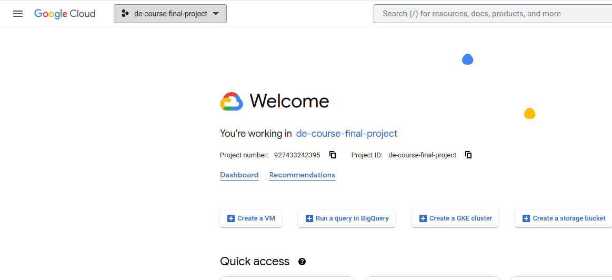
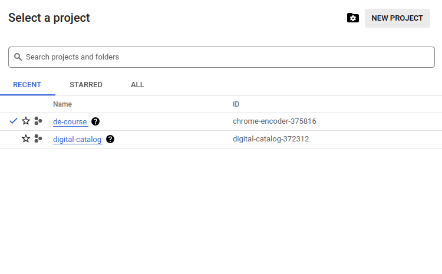
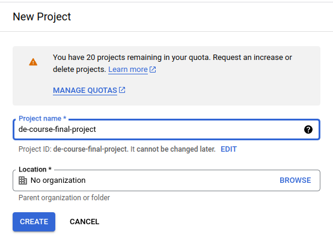
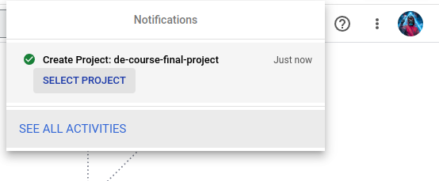
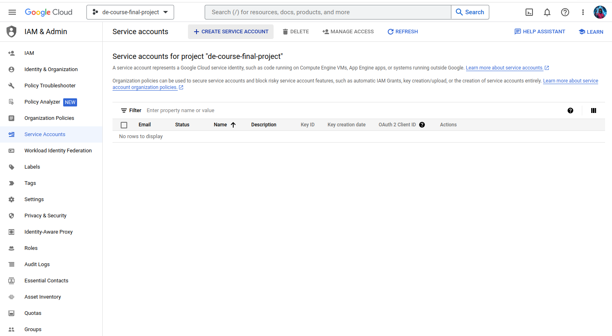
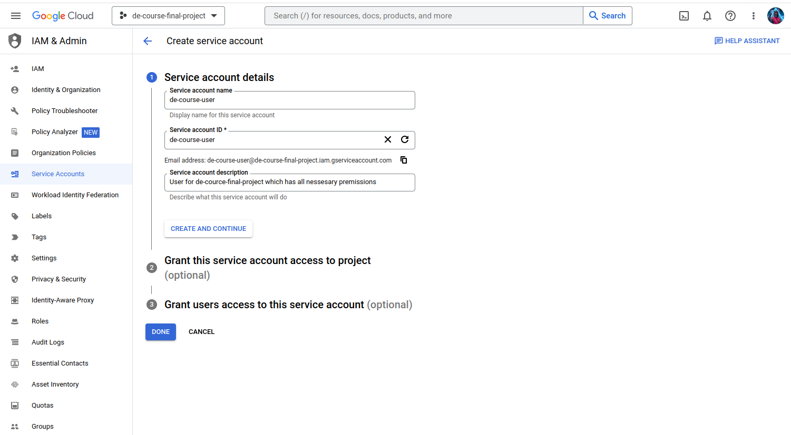
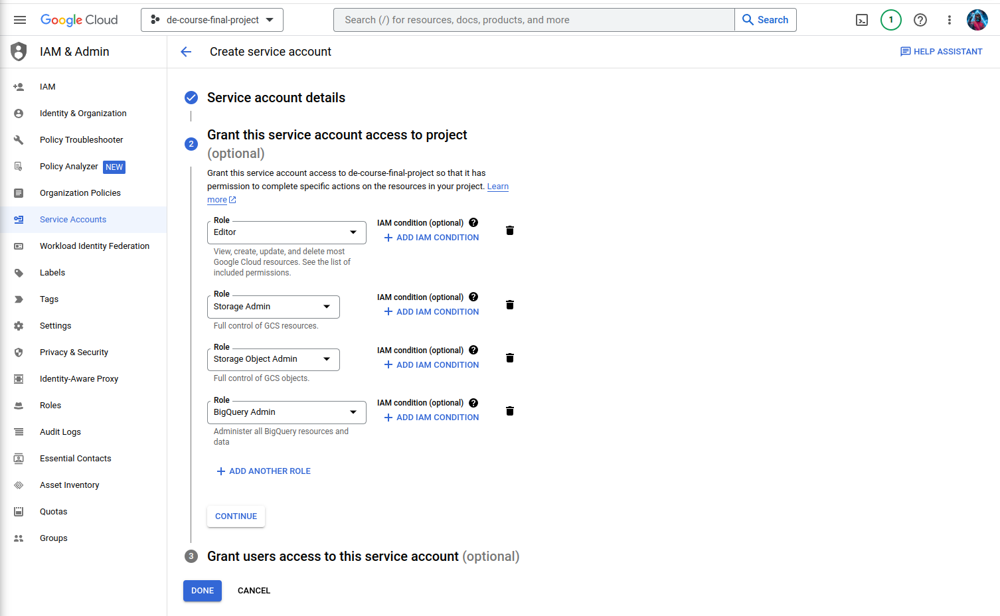
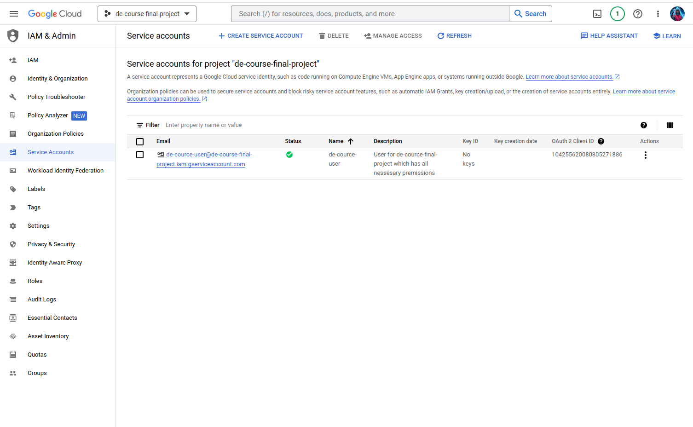
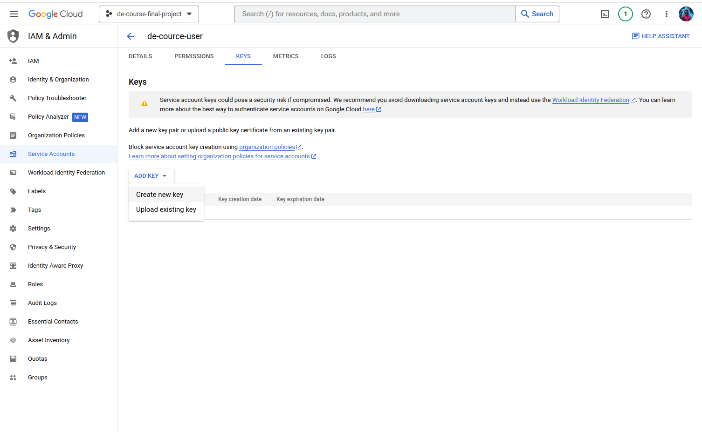
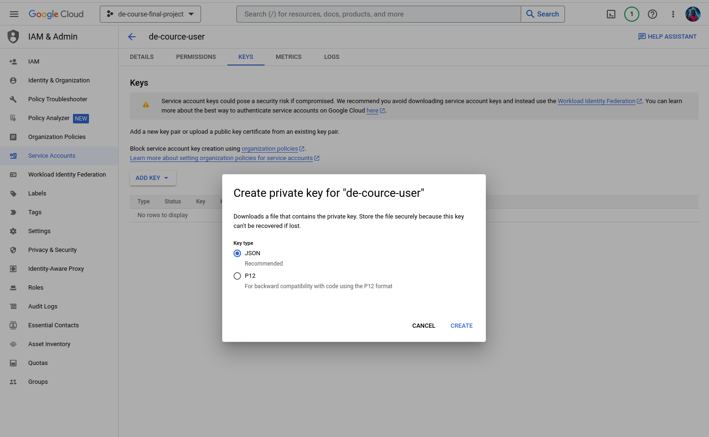

# `Google Cloud Platform` setup instructions

## Requirements

- Create account in `Google Cloud Platform`

## Creating project

1. Go to main menu and click on button with current project:

2. Click on `NEW PROJECT`:

3. Enter only project name and click on `CREATE`:

4. After that you can see notification that your project successfully created. Click on `SELECT PROJECT`:

## Creating service account

1. Go to `IAM & Admin > Service Accounts` and click on `CREATE SERVICE ACCOUNT`:

2. Fill in all the required fields in the first step:

3. In the second step add all roles as in the screenshot below and click on `DONE`:

4. After that you can see yours service account. Click on `Email` value for your account:

5. Got to `KEYS` section and click on `ADD KEY`

6. Select `JSON` format for your key and download file to `credentials` directory:

