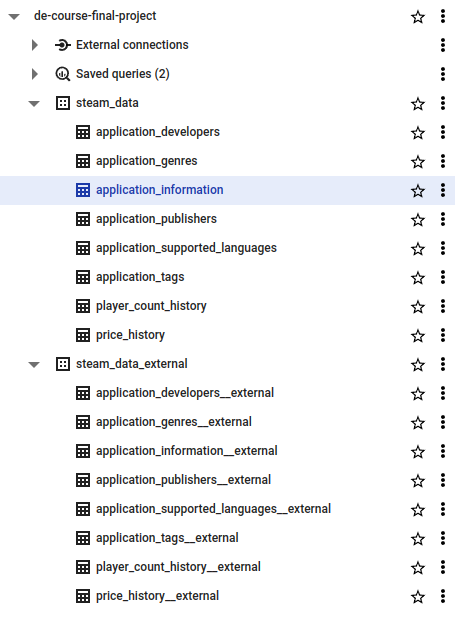

# SQL queries

This directory contains sql scripts for creating table in `steam_data` and `steam_data_external` datasets.

## Requirements

- Init project infrastructure with `terraform`.
- Upload data to `steam_data_927433242395` bucket with Airflow dags.

## Query execution sequence

1. `create_external_tables.sql`
2. `create_tables.sql`

After running all queries you can see this project structure in `BigQuery`:

