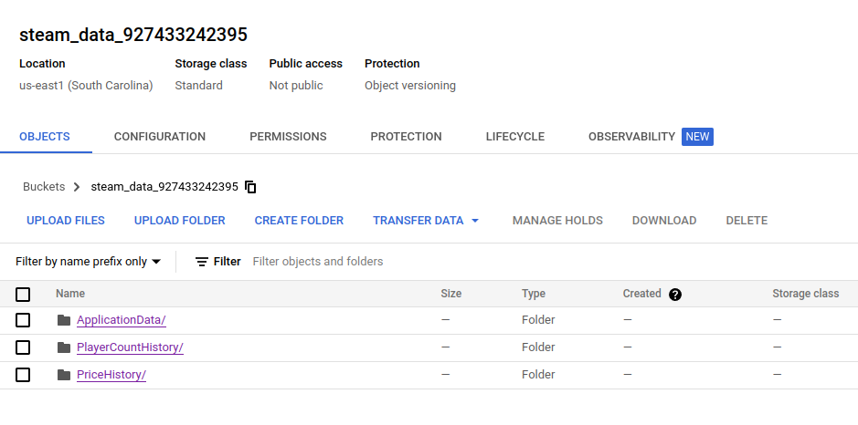

# Terraform

In this directory contains terraform configuration which creates infrastructure in `Google Cloud` such as:

- Bucket `stack_overflow_ads`
- Big Query dataset `stack_overflow_ads`

> **Note**: In real project `variables.tf` file must be in `.gitignore`

## Requirements

- Create `Google Cloud` account and setup service account (see [instructions for setup GCP account and servie account](../docs/gcp_setup.md)).
- Install [Terraform](https://developer.hashicorp.com/terraform/downloads)

## Local setup and run

1. Fulfill all the requirements above
2. Initialize terraform infrastructure with command
    ```bash
    terraform init
    ```
   Example:
   ```bash
   ➜  terraform terraform init   

   Initializing the backend...
   
   Successfully configured the backend "local"! Terraform will automatically
   use this backend unless the backend configuration changes.
   
   Initializing provider plugins...
   - Reusing previous version of hashicorp/google from the dependency lock file
   - Installing hashicorp/google v4.57.0...
   - Installed hashicorp/google v4.57.0 (signed by HashiCorp)
   
   Terraform has been successfully initialized!
   
   You may now begin working with Terraform. Try running "terraform plan" to see
   any changes that are required for your infrastructure. All Terraform commands
   should now work.
   
   If you ever set or change modules or backend configuration for Terraform,
   rerun this command to reinitialize your working directory. If you forget, other
   commands will detect it and remind you to do so if necessary.
   ```
   
3. Create terraform infrastructure with command and type `yes` when terraform will ask you to perform actions
    ```bash
    terraform apply
    ```
   
   Example:
   ```bash
   ➜  terraform terraform apply

   Terraform used the selected providers to generate the following execution plan. Resource actions are indicated with the following symbols:
     + create
   
   Terraform will perform the following actions:
   
     # google_bigquery_dataset.dataset will be created
     + resource "google_bigquery_dataset" "dataset" {
         + creation_time              = (known after apply)
         + dataset_id                 = "stack_overflow_ads"
         + delete_contents_on_destroy = false
         + etag                       = (known after apply)
         + id                         = (known after apply)
         + labels                     = (known after apply)
         + last_modified_time         = (known after apply)
         + location                   = "us-east1"
         + max_time_travel_hours      = (known after apply)
         + project                    = "927433242395"
         + self_link                  = (known after apply)
       }
   
     # google_storage_bucket.data-lake-bucket will be created
     + resource "google_storage_bucket" "data-lake-bucket" {
         + force_destroy               = true
         + id                          = (known after apply)
         + location                    = "US-EAST1"
         + name                        = "stack_overflow_ads_927433242395"
         + project                     = (known after apply)
         + public_access_prevention    = (known after apply)
         + self_link                   = (known after apply)
         + storage_class               = "STANDARD"
         + uniform_bucket_level_access = true
         + url                         = (known after apply)
   
         + lifecycle_rule {
             + action {
                 + type = "Delete"
               }
             + condition {
                 + age                   = 30
                 + matches_prefix        = []
                 + matches_storage_class = []
                 + matches_suffix        = []
                 + with_state            = (known after apply)
               }
           }
   
         + versioning {
             + enabled = true
           }
       }
   
   Plan: 2 to add, 0 to change, 0 to destroy.
   
   Do you want to perform these actions?
     Terraform will perform the actions described above.
     Only 'yes' will be accepted to approve.
   
     Enter a value: yes
   
   google_bigquery_dataset.dataset: Creating...
   google_storage_bucket.data-lake-bucket: Creating...
   google_bigquery_dataset.dataset: Creation complete after 2s [id=projects/927433242395/datasets/stack_overflow_ads]
   google_storage_bucket.data-lake-bucket: Creation complete after 2s [id=stack_overflow_ads_927433242395]
   
   Apply complete! Resources: 2 added, 0 changed, 0 destroyed.
   ```
   
after these actions, our project should create bucket `stack_overflow_ads` and `BigQuery` dataset `stack_overflow_ads`:




